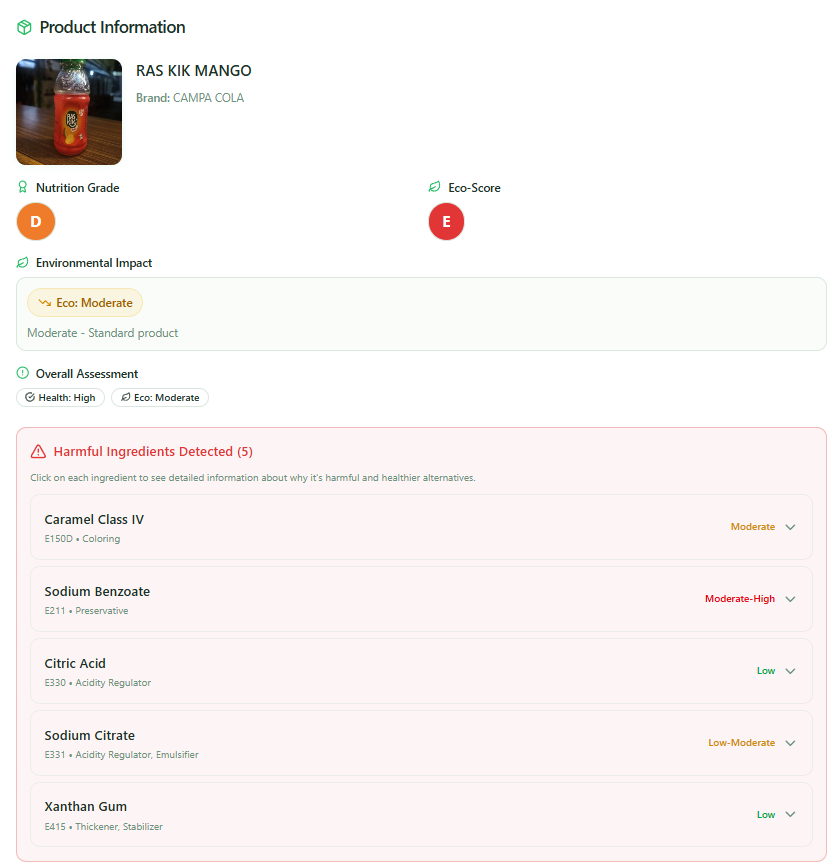
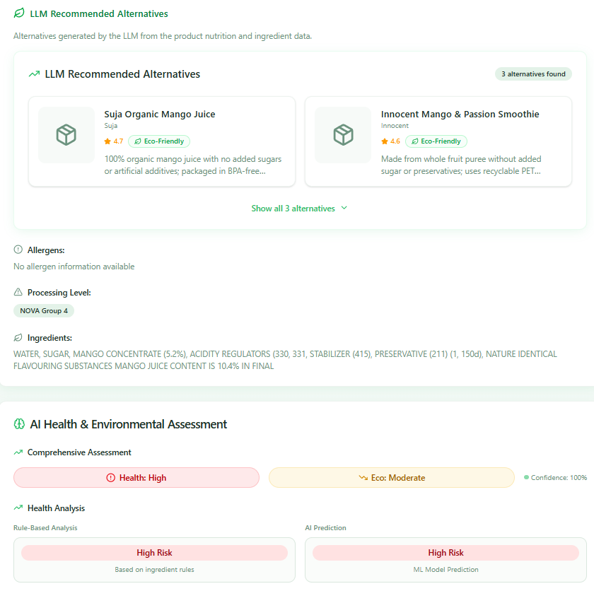
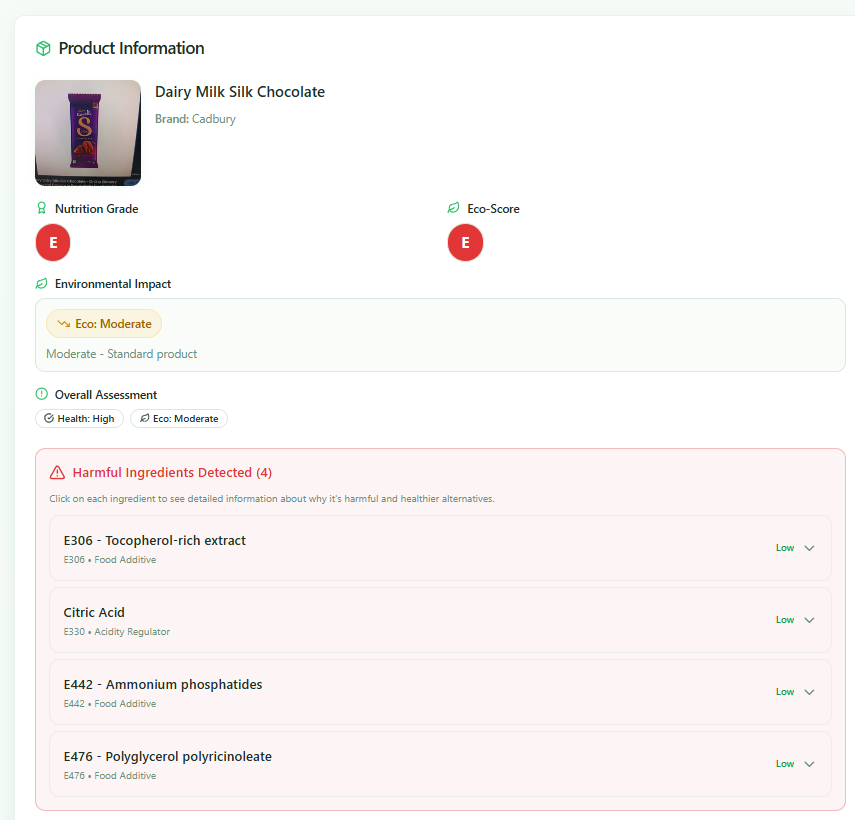
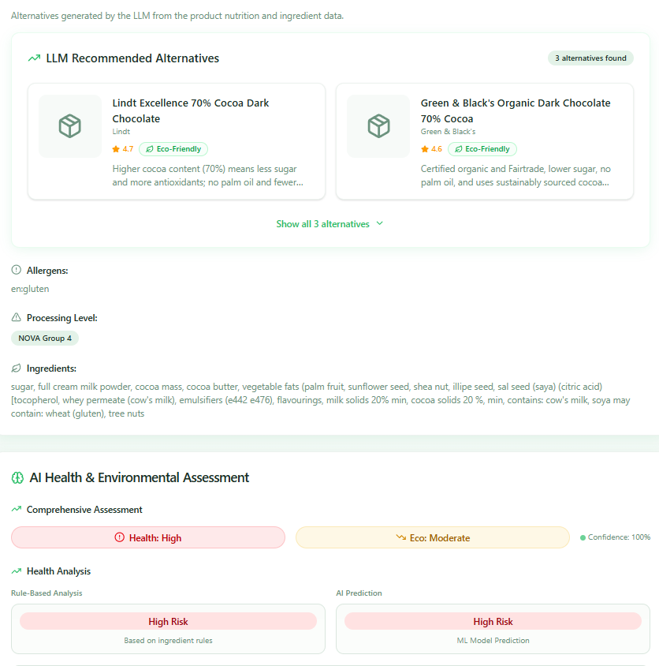

<div align="center">

# 🌿 EcoScan

### Scan smarter. Eat healthier. Choose greener.

[](https://react.dev/)
[](https://vitejs.dev/)
[](https://nodejs.org/)
[](https://expressjs.com/)
[](https://python.org/)
[](./LICENSE)

**EcoScan turns raw food labels into clear health and sustainability insights — instantly. It also includes an LLM-powered Analyze Food feature for both packaged and non-packaged foods, explaining risks, ingredient impact, and better alternatives in plain language.**

[🚀 Live Demo](https://nutri-scanner-one.vercel.app/) · [📖 Docs](#installation) · [🤝 Contributing](#contributing)

---

</div>

## 📸 Preview

<p align="center">
  
  
</p>
<p align="center">
  
  
</p>

---

## 🤔 Why EcoScan?

| Problem | EcoScan's Answer |
|---|---|
| 🏷️ Product labels are hard to compare | Clear per-nutrient breakdown at a glance |
| ⚠️ Health claims can mislead | Context-aware analysis with NOVA-based signals |
| 🌍 Sustainability is hard to judge | Single scorecard: packaging, palm oil, and more |

EcoScan combines **OpenFoodFacts data**, **OCR/barcode detection**, and **ML-assisted interpretation** to make food decisions more transparent.

---

## ✨ Features

- 📷 **Barcode scanning** from uploaded images
- 🔢 **Manual barcode lookup** for fast checks
- 🥗 **Nutrition analysis** — sugar, fat, salt, fiber, protein, energy
- 🧪 **Additives & processing context** with NOVA-based signals
- 🤖 **LLM Analyze Food** for natural-language analysis of packaged and non-packaged foods, plus healthier alternative suggestions
- 🌱 **Sustainability indicators** — packaging, palm oil
- 💡 **Actionable recommendation summary** per product
- 📱 **Mobile-friendly UI** for real-world use

---

## 🛠️ Tech Stack

| Layer | Technologies |
|---|---|
| **Frontend** | React 18, TypeScript, Vite, Tailwind CSS, Radix UI |
| **Backend** | Node.js, Express, Axios, Multer, Tesseract.js |
| **ML** | Python, scikit-learn |
| **Data** | OpenFoodFacts |
| **Deployment** | Vercel (frontend), Render (backend) |

---

## 🚀 Getting Started

### Prerequisites

- Node.js 16+
- npm 8+
- Python 3.8+

### 1. Clone the repo

```bash
git clone <your-repo-url>
cd EcoScan-React
```

### 2. Install dependencies

```bash
# Backend
cd backend && npm install

# Frontend
cd ../frontend && npm install

# ML layer
cd .. && pip install -r requirements.txt
```

### 3. Configure environment

Create `frontend/.env.local`:

```env
VITE_API_BASE_URL=http://localhost:3001
VITE_SITE_URL=http://localhost:5173
VITE_OG_IMAGE_URL=http://localhost:5173/og-image.svg
```

Optionally create `backend/.env`:

```env
PORT=3001
NODE_ENV=development
```

### 4. Run locally

```bash
# Terminal 1 — backend
cd backend && npm start

# Terminal 2 — frontend
cd frontend && npm run dev
```

Open **http://localhost:5173** in your browser.

---

## 🔄 How It Works

```
Upload image / enter barcode / describe non-packaged food
        ↓
Fetch from OpenFoodFacts
        ↓
Backend enrichment + ML health signal
        ↓
LLM-powered food analysis + alternatives
        ↓
Clear, human-readable insights
```

---

## 📡 API Reference

| Method | Endpoint | Description |
|---|---|---|
| `POST` | `/api/upload` | Detect barcode from uploaded image |
| `GET` | `/api/product/:barcode` | Retrieve product by barcode |
| `POST` | `/api/product/analyze` | Get full analysis and recommendations |

---

## 📁 Project Structure

```
EcoScan-React/
├── backend/        # Node.js/Express API
├── frontend/       # React + Vite app
├── ml/             # Python ML inference scripts
├── requirements.txt
└── README.md
```

---

## 🗺️ Roadmap

- [ ] Real-time camera barcode scanning
- [ ] Saved scan history and user dashboard
- [ ] Region-aware nutrition standards and warnings
- [ ] Better explainability for ML-based scoring

---

## 🤝 Contributing

Contributions are welcome! Here's how:

1. Fork the repository
2. Create a feature branch: `git checkout -b feature/your-feature`
3. Commit your changes: `git commit -m "feat: add your feature"`
4. Push and open a Pull Request

For substantial changes, **open an issue first** to discuss design and scope.

---

## 📄 License

This project is licensed under the [MIT License](./LICENSE).

---

<div align="center">

Made with 💚 · Data from [OpenFoodFacts](https://world.openfoodfacts.org/) · Deployed on [Vercel](https://vercel.com/)

</div>