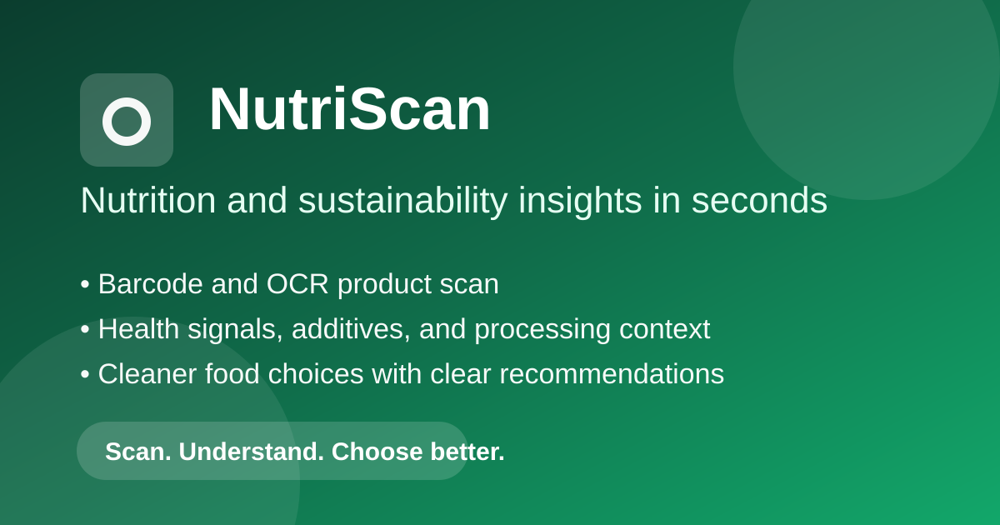

# EcoScan

### Scan smarter. Eat healthier. Choose greener.

[](https://react.dev/)
[](https://vitejs.dev/)
[](https://nodejs.org/)
[](https://expressjs.com/)
[](https://python.org/)

EcoScan helps users analyze food products by scanning or entering barcodes and turning raw label data into clear health and sustainability insights.

## Live Demo

- Frontend: https://your-app.vercel.app
- Backend API: https://your-api.onrender.com

Replace these links with your deployed URLs.

## Preview



For additional screenshots, add images in a `docs/screenshots/` folder and link them here.

## Why EcoScan

- Product labels are often hard to compare quickly.
- Health claims can be misleading without context.
- Sustainability decisions are easier with a single, clear scorecard.

EcoScan combines OpenFoodFacts data, OCR/barcode detection, and ML-assisted interpretation to make food decisions more transparent.

## Core Features

- Barcode scanning from uploaded images
- Manual barcode lookup for fast checks
- Product-level nutrition analysis (sugar, fat, salt, fiber, protein, energy)
- Additives and processing context (including NOVA-based signal)
- Sustainability-focused outputs such as packaging/plastic and palm-oil indicators
- Actionable recommendation summary for end users
- Mobile-friendly React UI for quick real-world use

## Tech Stack

- Frontend: React, TypeScript, Vite, Tailwind CSS, Radix UI
- Backend: Node.js, Express, Axios, Multer, Tesseract.js
- ML Layer: Python, scikit-learn model inference scripts
- Data Source: OpenFoodFacts
- Deployment: Vercel (frontend), Render or similar (backend)

## Project Structure

```text
EcoScan-React/
|- backend/
|- frontend/
|- ml/
|- requirements.txt
`- README.md
```

## Installation

### Prerequisites

- Node.js 16+
- npm 8+
- Python 3.8+

### 1. Clone

```bash
git clone <your-repo-url>
cd EcoScan-React
```

### 2. Install Dependencies

```bash
cd backend
npm install

cd ../frontend
npm install

cd ..
pip install -r requirements.txt
```

### 3. Configure Environment Variables

Create `frontend/.env.local`:

```env
VITE_API_BASE_URL=http://localhost:3001
VITE_SITE_URL=http://localhost:5173
VITE_OG_IMAGE_URL=http://localhost:5173/og-image.svg
```

Backend defaults work locally, but you can also add `backend/.env`:

```env
PORT=3001
NODE_ENV=development
```

## Usage

### Run Locally

Terminal 1:

```bash
cd backend
npm start
```

Terminal 2:

```bash
cd frontend
npm run dev
```

Open: http://localhost:5173

### Typical User Flow

1. Upload an image or enter a barcode.
2. EcoScan fetches product data from OpenFoodFacts.
3. Backend enriches results with analysis + ML-assisted health signal.
4. Frontend presents clear, human-readable insights.

## API Snapshot

- POST `/api/upload` - Detect barcode from uploaded image
- GET `/api/product/:barcode` - Retrieve product information
- POST `/api/product/analyze` - Get analysis and recommendation output

## Contributing

Contributions are welcome.

1. Fork the repository
2. Create a feature branch: `git checkout -b feature/your-feature`
3. Commit changes: `git commit -m "feat: add your feature"`
4. Push and open a Pull Request

For substantial changes, open an issue first to discuss design and scope.

## Roadmap Ideas

- Real-time camera barcode scanning
- Saved scan history and user dashboard
- Region-aware nutrition standards and warnings
- Better explainability for ML-based scoring

## License

Add your license information here (for example: MIT).